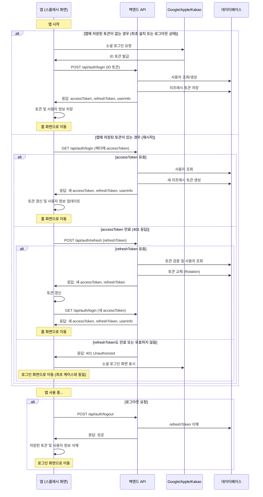

```mermaid
sequenceDiagram
    participant App as 앱 (스플래시 화면)
    participant API as 백엔드 API
    participant Google as Google/Apple/Kakao
    participant DB as 데이터베이스

    Note over App: 앱 시작

    alt 앱에 저장된 토큰이 없는 경우 (최초 설치 또는 로그아웃 상태)
        App->>Google: 소셜 로그인 요청
        Google->>App: ID 토큰 발급
        App->>API: POST /api/auth/login (ID 토큰)
        API->>DB: 사용자 조회/생성
        API->>DB: 리프레시 토큰 저장
        API->>App: 응답: accessToken, refreshToken, userInfo
        App->>App: 토큰 및 사용자 정보 저장
        Note over App: 홈 화면으로 이동
    else 앱에 저장된.토큰이 있는 경우 (재시작)
        App->>API: GET /api/auth/login (헤더에 accessToken)
        alt accessToken 유효
            API->>DB: 사용자 조회
            API->>DB: 새 리프레시 토큰 생성
            API->>App: 응답: 새 accessToken, refreshToken, userInfo
            App->>App: 토큰 갱신 및 사용자 정보 업데이트
            Note over App: 홈 화면으로 이동
        else accessToken 만료 (401 응답)
            App->>API: POST /api/auth/refresh (refreshToken)
            alt refreshToken 유효
                API->>DB: 토큰 검증 및 사용자 조회
                API->>DB: 토큰 교체 (Rotation)
                API->>App: 응답: 새 accessToken, refreshToken
                App->>App: 토큰 갱신
                App->>API: GET /api/auth/login (새 accessToken)
                API->>App: 응답: 새 accessToken, refreshToken, userInfo
                Note over App: 홈 화면으로 이동
            else refreshToken도 만료 또는 유효하지 않음
                API->>App: 응답: 401 Unauthorized
                App->>Google: 소셜 로그인 화면 표시
                Note over App: 로그인 화면으로 이동 (최초 케이스와 동일)
            end
        end
    end

    Note over App: 앱 사용 중...

    alt 로그아웃 요청
        App->>API: POST /api/auth/logout
        API->>DB: refreshToken 삭제
        API->>App: 응답: 성공
        App->>App: 저장된 토큰 및 사용자 정보 삭제
        Note over App: 로그인 화면으로 이동
    end
```
